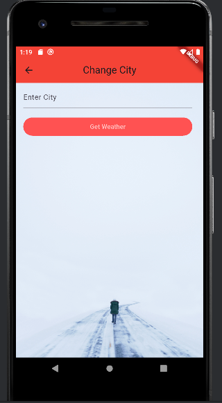
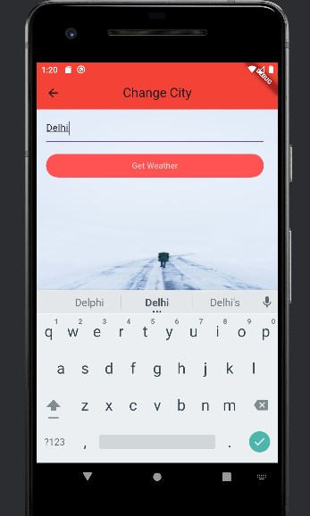
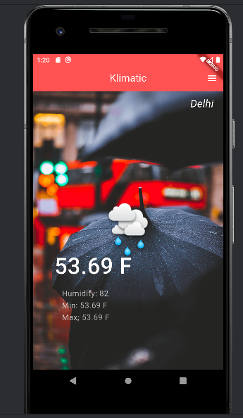

# Klimatic - Flutter Weather App

A simple **Weather App** built with **Flutter** that allows users to view the current weather of any city using the OpenWeatherMap API. Users can also change the city to see updated weather information.

---

##  Features

- View current temperature of a city
- Display additional weather info (Humidity, Min/Max Temp)
- Change city dynamically
- Beautiful background images for different weather conditions
- Responsive UI using Flutter widgets

---

##  Screenshots

### Home Screen


### Enter City Screen


### Delhi Entered Screen


### Delhi Home Screen


---
## Tech Stack

- Flutter - Frontend UI

- Dart - Programming language

- OpenWeatherMap API - Fetch weather data

- HTTP package - API calls

- FutureBuilder - Async UI updates

## ⚙️ Installation

1. Clone this repository
```bash
git clone https://github.com/abdulazizpatwary/klimatic.git
